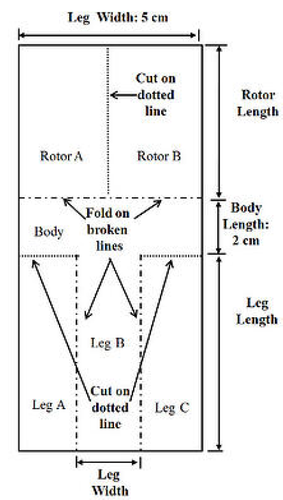

```{r, include=FALSE}
# loading libs
library(dplyr)
library(tidyr)
library(ggplot2)
library(faraway)
library(car)
library(mgcv)
library(MASS) # for negative binomial
library(mlegp)
```

# **Problem 1**: Regression Modeling - Generalized Linear Model vs Linear Regression Model

Perform a detailed regression analysis using the gala data set. Use *Species* as the response variable, *excluding Endemics from this analysis*, to address the following questions:

```{r}
# loading data
data(gala)

# remove endemics from dataset
gala <- subset(gala, select = -Endemics)
summary(gala)
head(gala)
```

---

### 1. Conduct a regression analysis using one of the generalized linear models we covered in Week 7 (i.e., logistic regression or Poisson regression) and perform model selection.


- From the dataset description, we are told that 'Species' is a count of the number of plant species found on the island. 

- Since 'Species' is a count, a normal distribution (Linear Regression) would not be the best choice as that allows for negative values.

- Species' is not a binary value, nor is it a category type variable, thus Logistic Regression is not a reasonable choice as our GLM.

- Using summary(gala) we can confirm that 'Species' has no negative values (min=2). Based on these details, we can predict that Poisson will be the best fit to the data. However, we will confirm this further...

```{r}
# histogram of species
hist(gala$Species, breaks = 10, main = "Distribution of Species Counts", col = 'lightgreen')
```

- From the histogram, we can see that the distribution of 'Species' is skewed right, alluding to Poisson model being the best choice for our generalized linear model. However we must check for over-dispersion as if true then a quasi-poisson or negative binomial model would be a better choice.

```{r}
# mean vs varience
mean(gala$Species)
var(gala$Species)
```

- We can see that the variance of 'Species' is greater than it's mean, indicating that Poisson (including quasi-poisson due to the **significantly** large difference) would not be the best fit due to over-dispersion. Rather, a negative binomial model would be better.

```{r}
# fitting neg binom
gala_negbinom <- glm.nb(Species ~ Area + Elevation + Nearest + Scruz + Adjacent, data = gala)
summary(gala_negbinom)
```

- Using a negative binomial model as our Generalized Linear Model, we can see that certain variables (such as 'Nearest' & 'Scruz') are not useful as predictors. I will now optimize our GLM and refine the model using stepwise model selection.

```{r}
# optimizing neg binom stepwise
# dir='backward' less risk of overfit than 'both'
optim_galaNB <- step(gala_negbinom, direction = "backward")
summary(optim_galaNB)
```

- As predicted, we can safely remove 'Nearest' & 'Scruz'. Based on this, we get a final regression equation of...

> Species ~ Area + Elevation + Adjacent

- We will not ensure that our model is valid by checking if model assumption are met:

```{r}
par(mfrow = c(2, 2))
plot(optim_galaNB)
```

- Check for model assumptions:

    - Residual vs. Fitted: Residuals are randomly scattered around 0 (x-axis) and do not show a clear pattern, confirming assumptions of homoscedasticity and linearity are met.

    - QQ Residuals: Residuals fall close to diagonal, confirms residuals follow a normal distribution.


### 2. Perform a linear regression analysis and conduct model selection again to determine the most appropriate linear regression model. Compare it with the GLM model selected in the previous question and comment on your findings.

```{r}
# basic linear model
lm_gala <- lm(Species ~ ., data = gala)

# stepwise model selection
optim_galaLM <- step(lm_gala, direction = "backward")
summary(optim_galaLM)
```

- Similar to our GLM, stepwise model selection excluded predictors 'Nearest' & 'Scruz'. Additionally, stepwise selection also eliminated predictor 'Area'. This gives us a regression equation of:

> Species ~ Elevation + Adjacent

- We will now check model assumptions to ensure optimized linear model is valid.

```{r}
par(mfrow = c(2, 2))
plot(optim_galaLM)
```

    - Residual vs. Fitted: No clear pattern and located near 0, confirms homoscedasticity and linearity assumption.
  
    - QQ Plot: Residuals lie along diagonal, confirms normal distribution.
    
- Now we will compare our linear model with our previous GLM (negative binomial).

```{r}
AIC(optim_galaLM, optim_galaNB)
```

```{r}
BIC(optim_galaLM, optim_galaNB)
```


- Our negative binomial GLM shows to have lower AIC and BIC criterion value, proving it is the better choice over our linear regression model.

---

# **Problem 2**: Paper Helicopter Experiment

A researcher would like to investigate how long a paper ‘helicopter’ can stay in the air when dropped from a height of 2 meters. Here’s how she makes the paper helicopters to be used for the experiment. 
 


Source: https://blog.minitab.com/en/learning-design-of-experiments-with-paper-helicopters-and-minitab

- Step 1: Cut the paper to a width of 5cm.

- Step 2: Cut the paper the length of paper rotor length plus leg length, and add 2 cm for the body.

- Step 3: Cut dotted lines at Leg A and Leg C. The length of each cut is 5 cm minus leg width divided by 2.

- Step 4: Fold legs A and B onto leg B.

- Step 5: Fold rotor A and rotor B in opposite directions. They should form 90\text{\textdegree} to the body and be 180\text{\textdegree} away from each other.

Some potential treatment factors are: 

    1) Paper type (light, medium, and heavy)
    
    2) Rotor length (7.5cm or 8.5cm)
    
    3) Leg length (7.5cm or 12cm)
    
    4) Leg width (3.2cm or 5cm).

Answer the following questions:


### A. Suppose the researcher would like to compare the responses between different paper types while keeping other factors fixed. What are the experimental units and measurement units [^1] in this study? Which design can she apply?

[^1]: Please don’t confuse it with the other experimental unit, for example, seconds. Check the lecture slides in Week 8 for the definition of experimental unit in the context of design of experiments.

**Answer:**

- Experimental Unit: Our helicopter which will undergo the experiment, with different treatments or *paper type* being applied to them. *paper type* must be one of the following values: light, medium, or heavy.

- Measurement Unit: *flight time*, likely measured in seconds or milliseconds. The researcher would like to find the helicopter with the maximum *flight time*, with each helicopter receiving different treatments (*paper type*).

- Optimal Experiment Design: *Completely Randomized Design (CRD)*, since the researcher is observing response for only **one** changing factor (*paper type*) in each experimental unit (helicopter), while leaving other factors constant. 


### B. Suppose the researcher would like to conduct an experiment in (A) using 15 paper helicopters. Explain how she can perform the randomization and replication procedures here.

**Answer:**

- Randomization: Since only one factor, *paper type*, is changing for each treatment in the CRD, the researcher should assign each helicopter randomly to a paper type. This can be accomplished using a pseudo-random number generation in range(0, 2), with each *paper type* (light, medium, or heavy) being determined by the output. The **sample()** function in R or with Python's **random** package can accomplish this.

- Replication: Since the researcher will only produce a total of 15 experimental units (helicopters), and there are 3 types of treatments (*paper type*), each treatment (*paper type*) should make up exactly 5 helicopters. This is necessary to not only account for variability, but also to ensure enough data points are present for ANOVA statistical analysis to be valid.


### C. Think of a situation in which the researcher would need to consider using a randomized complete block design (RCBD).

**Answer:**

- Randomized CRD will be useful when noise is observed to introduce variability in the experiment. RCRD will reduce this experimental error within blocks (i.e. testing instances), resulting in more precise comparison between our changing treatments of *paper type*. 

- For example, if the researcher performs blocks at different times in the day, noise variables such as wind, temperature, and other factors from the environment could impact the results - preventing proper comparison between the treatments alone. For each block, the researcher should conduct experiment on all three treatments simultaneously from the same location, to ensure that noise variables are not causing variability in *flight time*, rather, just the treatment. 


### D. If the researcher wants to study the effects of leg length and width on the flying time of heavy paper helicopters, which design is most appropriate for this situation? If the researcher wants to have 5 replicates for each treatment combination, how many heavy paper helicopters does she need?

**Answer:**

- In this new experiment setup, the helicopter remains our experimental unit. Now, *paper type* is statically 'heavy', and its rotor length is kept constant; our treatments will be composed of variation of *leg length* and *leg width*. Our measurement unit will still remain *flight time*.

- Since the researcher wants to study the effects of 2 different treatments (changes in leg length (1) and width (2)), and each of those 2 treatments can be one of 2 values (leg length: 7.5 or 12cm; leg width: 3.2 or 5cm), we can see that we would use a **2x2** design. Thus a *Factorial Design* for the experiment would be optimal.

    - Factorial design will allow to measure both the main effects (does leg lenght or width affect flight time?) and the interaction effects (does effect of leg lenght depend on leg width, and vice versa).
    
    - Will have a total of 4 possible total treatment combinations.
    
- If 5 replicates (helicopters) per treatment are required, then the researcher would need a total of 20 'heavy' *paper type* helicopters, all of the same *rotor length*.


### E. Conduct your own experiment, including designing the experiment, collecting and analyzing the data, to investigate the effects of rotor length, leg length, and leg width on the response, while keeping the paper type fixed.

- As we want to study the effects of multiple independent variables on the response *simultaneously*, we will use a factorial design for this experiment. 

```{r}
# reproduce
set.seed(1)

rotor_length <- c(7.5, 8.5)
leg_length <- c(7.5, 12)
leg_width <- c(3.2, 5.0)

# full factorial design
design <- expand.grid(Rotor_Length = rotor_length, 
                      Leg_Length = leg_length, 
                      Leg_Width = leg_width)

# 5 replicates per treatment
replicates <- 5
experiment_data <- design %>%
  slice(rep(1:n(), each = replicates))

# rand val gen
experiment_data <- experiment_data %>%
  mutate(Flight_Time = round(runif(n(), min = 1.2, max = 2.0), 2))

# clean
experiment_data <- experiment_data %>%
  mutate(Rotor_Length = as.factor(Rotor_Length),
         Leg_Length = as.factor(Leg_Length),
         Leg_Width = as.factor(Leg_Width))

head(experiment_data)
summary(experiment_data)
```


- We will now perform analysis on our generated data by conducting 3-way ANOVA. 

```{r}
anova_model <- aov(Flight_Time ~ Rotor_Length * Leg_Length * Leg_Width, data = experiment_data)
summary(anova_model)
```

- We will first check our data to make sure model assumptions are satisfied for ANOVA.

```{r}
# asserting model assumptions
# normality
par(mfrow = c(1, 2))
hist(residuals(anova_model), main = "Residual Histogram", col = "lightblue")
qqnorm(residuals(anova_model))
qqline(residuals(anova_model), col = "red")

# homogeneity of varience
leveneTest(Flight_Time ~ Rotor_Length * Leg_Length * Leg_Width, data = experiment_data)
```

- QQ Plot: Points lie on or near the diagonal line, assumption is met.

- Levene's: Outputs a P Value of 0.99 > 0.05; homogeneity of variance assumption for ANOVA is met.


```{r}
# rotor
ggplot(experiment_data, aes(x = Rotor_Length, y = Flight_Time, fill = Rotor_Length)) +
  geom_boxplot() +
  labs(title= "Rotor Len vs. Flight Time",
       x= "Length (cm)", y= "Time(sec)") +
  theme_minimal()

# leg len
ggplot(experiment_data, aes(x = Leg_Length, y = Flight_Time, fill = Leg_Length)) +
  geom_boxplot() +
  labs(title= "Leg Len vs. Flight Time",
       x= "Length(cm)", y= "Time(s)") +
  theme_minimal()

# leg width
ggplot(experiment_data, aes(x = Leg_Width, y = Flight_Time, fill = Leg_Width)) +
  geom_boxplot() +
  labs(title= "Leg Width vs. Flight Time",
       x= "Width(cm)", y="time(sec)") +
  theme_minimal()

# interaction plot
ggplot(experiment_data, aes(x = Rotor_Length, y = Flight_Time, fill = Rotor_Length)) +
  geom_boxplot() +
  facet_grid(
    rows= vars(Leg_Length), 
    cols= vars(Leg_Width), 
    switch= "both", 
    labeller= labeller(Leg_Length = label_both, Leg_Width = label_both)
    ) +
  labs(
    title= "Effect of Rotor Length, Leg Length, and Leg Width on Flight Time",
    x= "Rotor len(cm)", 
    y="Flight time(s)" ) +
  theme_minimal() +
  theme(
    strip.placement = "outside",
    strip.text = element_text(face= "bold")
    )
```

**Analysis Conclusions**

- Rotor Length: Copters with rotor lengths of 8.5cm consistently outperform those with 7.5cm rotors.

- Leg Length: In general, leg lengths of 12cm outperform copters with 7.5cm length legs.

- Leg Width: Copters with smaller 3.2cm leg widths show to fly longer than those with 5cm leg widths.

- Interaction: Our plot confirms that copters with rotor length = 8.5cm, leg length = 12cm, and leg width = 3.2cm have the longest flight time.

---

# **Problem 3**: Paper Helicopter Computer Experiment

A sophisticated computer model has been developed to study how the flying time depends on the rotor length and leg length. The output of the computer can be found in ProjectII_prob2_data.RData.

  **x1**: rotor length (cm)
    
  **x2**: leg length (cm)
    
  **y**: flying time (seconds)
    
```{r}
# load data
load("ProjectII_prob2_data.RData")
```

Answer the following questions:


### A: Compute and visualize the prediction surface by computing the predicted values at a dense set of grid points:

    x1g <- seq(6, 10, 0.1)
    
    x2g <- seq(6, 12, 0.2)
    
    grids <- expand.grid(x1g, x2g)
    
```{r}
copter_df <- data.frame(x1 = x1, x2 = x2, y = y)
head(copter_df)
# fitting GAM
copter_gam <- gam(y ~ x1 + x2, data = copter_df)
summary(copter_gam)
```

```{r}
# dense set
x1g <- seq(6, 10, 0.1)
x2g <- seq(6, 12, 0.2)
grids <- expand.grid(x1 = x1g, x2 = x2g)

# pred on grid
grids$pred_y <- predict(copter_gam, newdata = grids)
```

```{r}
# prediction heatmap
ggplot(grids, aes(x = x1, y = x2, fill = pred_y)) +
  scale_fill_viridis_c() + #contour plt color
  geom_tile() +  
  labs(title= "Heatmap Prediction Surface: Flight Time",
       x= "Rotor len(cm)",
       y= "Leg Len(cm)",
       fill="Pred. Flight Time(sec)") +
  theme_minimal()

# contour plot
ggplot(grids, aes(x = x1, y = x2, z = pred_y)) +
  geom_contour_filled() +
  labs(title = "Prediction Contour: Flight time",
       x = "Rotor len(cm)",
       y = "Leg len(cm)",
       fill = "Bins(sec)") +
  theme_minimal()
```


### B. Compute and visualize the prediction uncertainty using a Gaussian process model. Briefly comment on your findings.

```{r}
library(GPfit)

# helper func
norm <- function(x) {
  x_normed <- (x - min(x)) / (max(x) - min(x))
  return(x_normed)
  }

# normalizing data
copter_df$x1_scaled <- norm(copter_df$x1)
copter_df$x2_scaled <- norm(copter_df$x2)

# fitting gaus process
gaus_model <- GP_fit(copter_df[, c("x1_scaled", "x2_scaled")], copter_df$y)

# dense grid
x1g <- seq(6, 10, 0.1)
x2g <- seq(6, 12, 0.2)
grids2 <- expand.grid(x1 = x1g, x2 = x2g)

# norm dense grid
grids2$x1_scaled <- (grids2$x1 - min(copter_df$x1)) / (max(copter_df$x1) - min(copter_df$x1))
grids2$x2_scaled <- (grids2$x2 - min(copter_df$x2)) / (max(copter_df$x2) - min(copter_df$x2))

# preding on gaus process model
gaus_preds <- predict(gaus_model, grids2[, c("x1_scaled", "x2_scaled")])
# pred uncertainty
grids2$pred_sd <- sqrt(gaus_preds$MSE)
```

```{r}
ggplot(grids2, aes(x = x1, y = x2, fill = pred_sd)) +
  geom_tile() +
  scale_fill_viridis_c() +
  labs(title = "Heatmap - Gaussian Prediction Uncertainty",
       x = "Rotor Len",
       y = "Leg Len",
       fill = "prediction standard deviation") +
  theme_minimal()
```

- Our plot shows large amounts of uncertainty around the edges, meaning uncertainty is high when...

    - Leg length is at its minimum or maximum value, and Rotor length is at any value.
    
  or
  
    - Rotor length is at its maximum or minimum value, and Leg length is of any value.

  or
  
    - Both Rotor and Leg length are at their maximum value, or when both are at their minimum value.

and is specifically the greatest when...

    - Rotor length is at its minimum and Leg length is slightly above 10cm.
    
and

    - Leg length is at its minimum and Rotor length is 7cm or very slightly above.
    
and

    - Leg and Rotor length both are at their maximum value of 12cm and 10cm respectively.
    
  