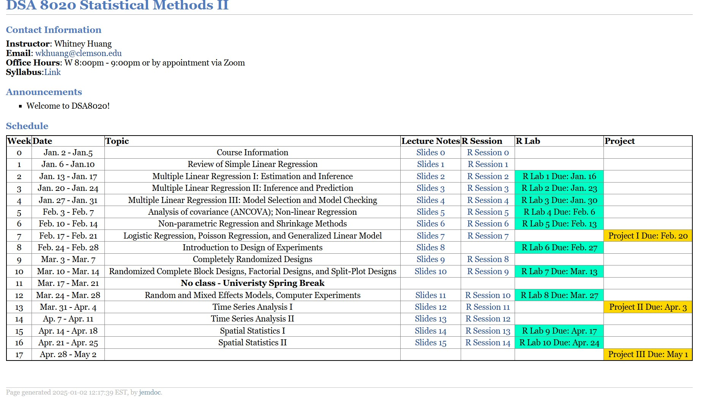

**DSA 8020: Statistical Methods II Spring 2025** (Fully Online)
===============================================================

**Instructor:** Whitney Huang 

**Email:** [wkhuang@clemson.edu ](mailto:wkhuang@clemson.edu)

**Office:** O-221 Martin Hall 

**Office Phone:** (864) 656-3070

*Office Hours: Weekly Zoom night sessions (Wednesdays 8:00pm-9:00pm ET) and by appointment.*

## Reference Books:

- Linear Models with R, 2nd Edition, Julian Faraway, 2014 [\[Link\]](https://julianfaraway.github.io/faraway/LMR/)
- An Introduction to Statistical Learning: with Applications in R, 2nd Edition, Gareth James, Daniela Witten, Trevor Hastie, and Robert Tibshirani, 2021 [\[Link\]](https://www.statlearning.com/)
- Extending the Linear Model with R, 2nd Edition, Julian Faraway, 2016 [\[Link\]](https://julianfaraway.github.io/faraway/ELM/)
- A First Course in Design and Analysis of Experiments, Gary W. Oehlert, 2010 [\[Link\]](http://users.stat.umn.edu/~gary/book/fcdae.pdf)
- Design and Analysis of Experiments, 2nd Edition, Angela Dean, Daniel Voss, and Danel Draguljic, 2017 [\[Link\]](https://www.springer.com/us/book/9783319522487?gclid=EAIaIQobChMIjMn49Meu5gIVgpOzCh1RRQdaEAQYAiABEgIkVPD_BwE)

Statistical Software: The R project for Statistical Computing ([https://www.r-project.org/) ](https://www.r-project.org/)and RStudio ([https://rstudio.com/products/rstudio/), an integrated](https://rstudio.com/products/rstudio/) development environ- ment (IDE) for R.

## Prerequisites:

- DSA 8010 (Statistical Methods I)
- Basic statistical computing knowledge: R and RStudio will be used in class

## Course Objectives:

Upon successful completion of this course, students should be able to:

0. read data into a computer package
1. summarize and interpret data
2. apply statistical techniques and knowledge appropriately
3. perform statistical analyses using a software package and interpret software output
4. draw appropriate conclusions and inferences from data

## Statement of instructor/student interaction:

- Students are expected to interact with each other and with the instructor on a weekly basis. Interactive discussions on course topics will take place in Discussion Board on Canvas.

## Attendance:

- This course is entirely asynchronous. Successful students will engage with the course material each week and participate on a regular basis.

## Course Grading:

- Students will be expected to demonstrate ability in computation, critical statistical thinking, and clear communication of statistical methods and results. Grades will be weighted as follows:

| 
R Labs Project I Project II Project III
 | 
25% 25% 25% 25%
 |
|-----------------------------------|-----------------------------------|

- Final course grades will be assigned using the following grading scheme:

| 
>= 90.00

88.00 ∼ 89.99

85.00 ∼ 87.99

80.00 ∼ 84.99

78.00 ∼ 79.99

75.00 ∼ 77.99

70.00 ∼ 74.99

68.00 ∼ 69.99

 <= 67.99
 | 
A

A-

B+

B

B-

C+

C

C-

F
 |
| - | - |

## Key Dates:

Students can use iROAR to add courses through **Jan. 14, Tuesday**, to drop courses without record through **Jan. 22, Wednesday**, and to drop with a W grade through **Mar. 14, Friday**.

- **Jan. 20, Monday**: Martin Luther King Jr. holiday
- **Mar. 17 - Mar. 21**: Spring Break

## Make-up Work Due to Missed Attendance:

1. Students should speak with their course instructors regarding any scheduled absence as soon as possible and develop a plan for any make-up work.
2. In the event of an emergency, the student should make direct contact with the course in- structor, preferably before a class or an exam takes place. It is the student’s responsibility to secure documentation of emergencies, if required.
2. Course instructors must implement fair grading procedures and provide an opportunity to make up missed assignments and examinations that does not unfairly penalize the student. Issuing specific dates by which make up work must be submitted without confirmation from the student could constitute unfair penalization, as students with illness (including COVID- 19-related illness) may not always respond in a timely manner. Such make-up work shall be at the same level of difficulty with the missed assignment or examination. Course in- structors shall hold all students to the same standard for making up missed assignments or examinations.
2. While course instructors should seek to make reasonable accommodation for a student in- volved in University-sponsored activities, students should understand that not every course can accommodate absences and that absences do not lessen the need to meet all course ob- jectives.

## Notification of Absence:

1. The Notification of Absence module in Canvas allows students to quickly notify instructors (via an email) of an absence from class and provides for the following categories: court attendance, death of family member, illness (or COVID-19 related isolation), illness of family member, injury, military duty, religious observance, scheduled surgery, university function, unscheduled hospitalization, other anticipated absence, or other unanticipated absence. The notification form requires a brief explanation, dates and times. Based on the dates and times indicated, instructors are automatically selected, but students may decide which instructors will receive the notification. This does not serve as an “excuse” from class, and students are encouraged to discuss the absence with their instructors. If a student is unable to report the absence electronically, he/she may call the Office of Advocacy and Success at 656- 0935 for assistance and guidance.
1. The Office of Advocacy and Success also assists students in identifying various appropriate methods of documenting absences and assists families in using the electronic Notification of Absence system when students are unable to do so themselves.

## Policies on Incompletes and Medical Withdrawals:

1. Issuing an “Incomplete” grade (I) to a student is an option if a student is unable to complete makeup work in a timely manner due to COVID-19 related illness or other issues. An In- complete indicates that a relatively small part of the semester’s work remains undone. It is not intended for students who are failing a course otherwise. In the event that an Incomplete is appropriate, students will contact instructors in a timely manner so that instructors can provide a reasonable opportunity to complete remaining work. Instructors and students will work together to resolve the Incomplete grade as soon as possible, not to exceed thirty days from the first day of classes in the next scheduled session (excluding summer sessions and regardless of the student’s enrollment status). More information on an Incomplete grade can be found in the Undergraduate Catalog.
2. Sometimes due to illness (including COVID-19 related illness) or other life circumstances, students may not be able to complete academic work for the term and will need to withdraw from all classes. The Division of Undergraduate Studies will process medical withdrawals. Students should contact the Division by sending an email from their Clemson email address to Lisa Traynham at lltrayn@clemson.edu.

If you report testing positive for COVID or have been asked to quarantine/isolate because of exposure to the virus, it will be up to you to inform your instructor that you will be moving to online only instruction for at least the next two weeks. Students are directed to use the Notification of Absence module in Canvas to initiate this notification. Additional communication via email is encouraged; you should follow up with your instructor to develop a continued plan of study.

## Academic Integrity Statement:

*“As members of the Clemson University community, we have inherited Thomas Green Clemson’s vision of this institution as a ‘high seminary of learning.’ Fundamental to this vision is a mutual commitment to truthfulness, honor, and responsibility, without which we cannot earn the trust and respect of others. Furthermore, we recognize that academic dishonesty detracts from the value of a Clemson degree. Therefore, we shall not tolerate lying, cheating, or stealing in any form. In instances where academic standards may have been compromised, Clemson University has a responsibility to respond appropriately to charges of violations of academic integrity.”*

Please refer to the current Graduate School Policy Handbook for the graduate academic integrity policy.

## Disability Access Statement:

It is university policy to provide, on a flexible and individualized basis, reasonable accommodations to students who have disabilities. Students with disabilities requesting accommodations should make an appointment with Disability Services (656-6848), to discuss specific needs within the first month of classes. Students should present a Faculty Accommodation Letter from Student Disability Services when they meet with instructors. Accommodations are not retroactive and new Faculty Accommodation Letters must be presented each semester.

## Title IX Statement:

This policy is located at [http://www. clemson.edu/campus-life/campus-services/access/non-discrimination-policy.html. Ms. ](http://www.clemson.edu/campus-life/campus-services/access/non-discrimination-policy.html). Alesia Smith is the Executive Director for Equity Compliance and the Title IX Coordinator. Her office is located at *223 Holtzendorff Hall*, phone number is *(864) 656-3181*, and email address is alesias@clemson.edu.

# Topics:

## Part I: Regression Analysis (7 weeks)

- Review of Simple Linear Regression
- Multiple Linear Regression: Statistical Inference; Model Selection and Diagnostics
- Regression Models with Quantitative and Qualitative Predictors
- Nonlinear and Non-parametric Regression
- Ridge Regression and Lasso
- Logistic Regression, Poisson Regression, and Generalized Linear Model (GLM)

## Part II: Experimental Design (4 weeks)

- Introduction to Experimental Design: Principles and Techniques
- Completely randomized Designs, Block Designs, Nested and Split-Plot Designs
- Random and Mixed Effects Models
- Computer Experiments

## Part III: Spatial and Time Series Analysis (4 weeks)

- Stationary Processes in Time and Autocovariance Function
- Autoregressive Integrated Moving Average (ARIMA) Models and Seasonal Models
- Stationary and Isotropic Processes in Space
- Gaussian Process Spatial Interpolation (a.k.a Kriging)
